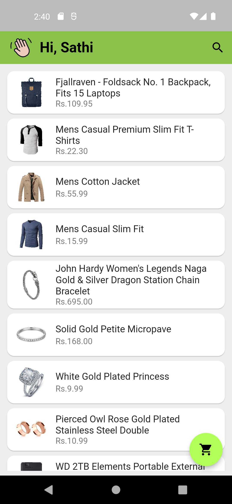
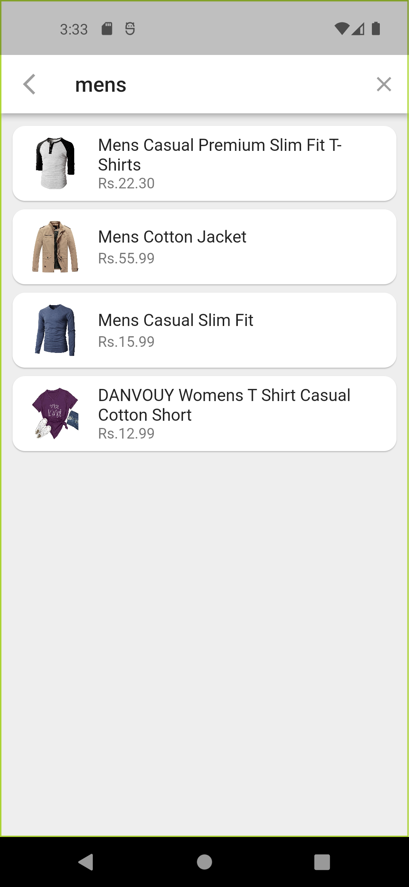
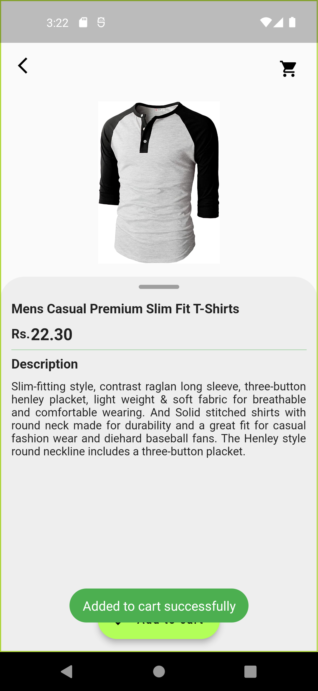
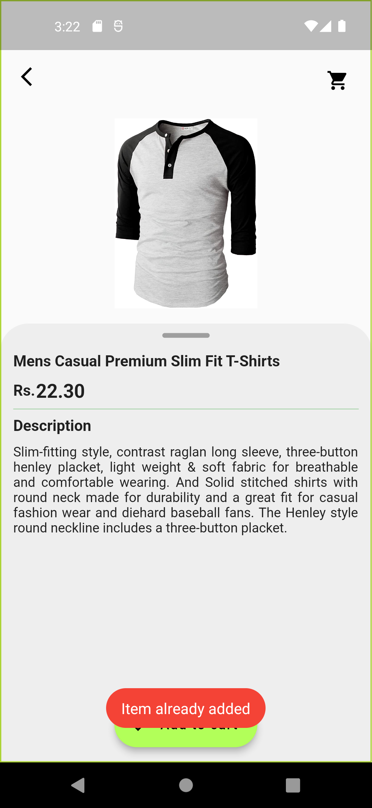
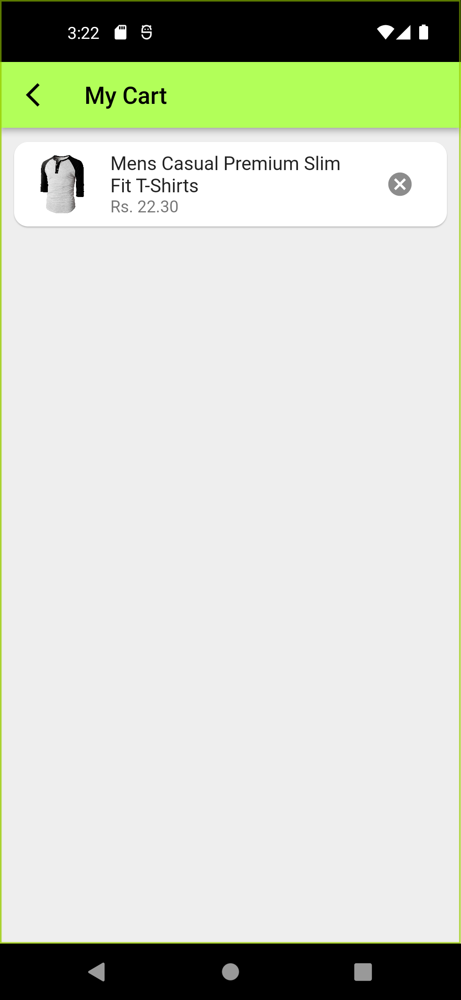

# onlinestore

### APK Downloads
- [Download ARM-v7a APK](build\app\outputs\flutter-apk\app-armeabi-v7a-release.apk) (6.5MB)
- [Download ARM64-v8a APK](build\app\outputs\flutter-apk\app-arm64-v8a-release.apk) (7.0MB)
- [Download x86_64 APK](build\app\outputs\flutter-apk\app-x86_64-release.apk) (7.1MB)

## 1. Home Page
- Shows the list of products fetch from fakeapi
- To search the product click on search icon
- To see what are added to cart click the floating button at the bottom side

## 2. Search Bar
- Type any product name and enter
- CLick on any result product and it will naviagte to product detail page

## 3. Product detail
- Shows the product name, price, and its short descrption
- User can add current item to cart
- User can not add the item to cart more than one time, if the item is already added to cart it will show a message "Item already added"

## 4. My Cart Page
- Added item is shown in this page
- Added item can be deleted or remove from there

